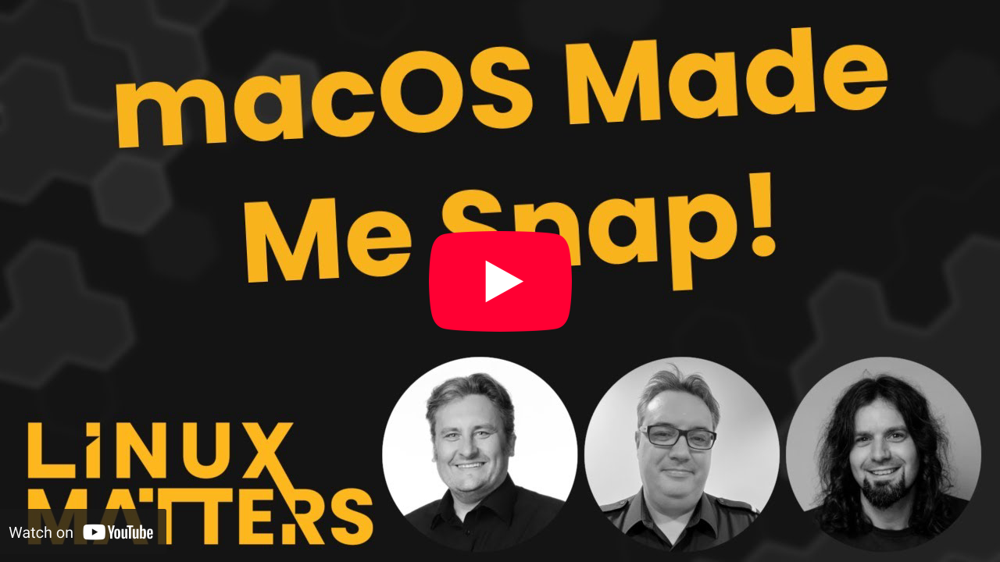

# Jivefire 🔥

> Spin your podcast .wav into a groovy MP4 visualiser with spring-driven real-time audio frequencies.

## The Groove

Your podcast audio deserves more than a static image on YouTube. Jivefire transforms WAV/MP3/FLAC into delightful 720p visuals—bars that breathe with your dialogue, rise with your laughter, and groove through every frequency.

<div align="center"></div>

### What's Cooking

- 🖼️ **Thumbnail generator** YouTube-style PNG with your title, saved alongside the video
- 🎬 **1280×720 @ 30fps** H.264/AAC YouTube-ready MP4, no questions asked
  - 🎚️ **64 frequency bars** that actually look discrete (not that smeared spectrum nonsense)
  - 🪞 **Symmetric mirroring** above and below centre, doubles the visual impact
  - 🔬 **FFT-based analysis** 2048-point Hanning window, log scale frequency binning
  - ✨ **Spring-driven bar dynamics** bars snap up instantly, spring back down via harmonica peak-hold
- 🚀 **Stupidly fast** streaming pipeline, parallel RGB→YUV conversion
  - ⚡ **GPU acceleration** auto-detected: NVENC, Vulkan, VA-API, QuickSync, VideoToolbox
- 📦 **Single binary** No Python. No FFmpeg install required. Just drop and render
  - 🐧 **Linux** (amd64 and aarch64)
  - 🍏 **macOS** (x86 and Apple Silicon)

## Usage

### Generate Video
```bash
./jivefire input.wav output.mp4
```

### With Episode Number and Title
```bash
./jivefire --episode=42 --title="Linux Matters" input.wav output.mp4
```

### Without Episode Number (unnumbered audio)
```bash
./jivefire --title="Linux Matters" input.wav output.mp4
```

`--episode` is optional. Omitting it suppresses the episode number overlay entirely — useful for archive or bonus audio that has no episode number. Passing `--episode=0` still renders `0` on-screen; absence is what controls the overlay, not the value.

### Example

<div align="center">
  <a href="https://www.youtube.com/watch?v=VPJEQhdaXrk" target="_blank">
    
  </a>
</div>

## Build

Jivefire uses [ffmpeg-statigo](https://github.com/linuxmatters/ffmpeg-statigo) for FFmpeg static bindings.

```bash
# Setup or update ffmpeg-statigo submodule and library
just setup

# Build and test
just build        # Build binary
just test         # Run tests
just test-encoder # Test encoder
```

## Why Jivefire?

FFmpeg's audio visualisation filters (`showfreqs`, `showspectrum`) render continuous frequency spectra, not discrete bars. No amount of FFmpeg filter chain kung-fu can achieve the discrete 64-bar aesthetic required for Linux Matters branding. Solution: Do the FFT analysis and bar rendering in Go, pipe frames to FFmpeg for encoding.

**Why Go over Python?** The original `djfun/audio-visualizer-python` tool is a moribund Qt5 GUI with significant tech debt. For our podcast production needs we wanted multi-archtitecture tools that's that can integrate into automation pipelines.

The Jivefire architecture, such as it is, is available in the [ARCHITECTURE.md](docs/ARCHITECTURE.md) document.
